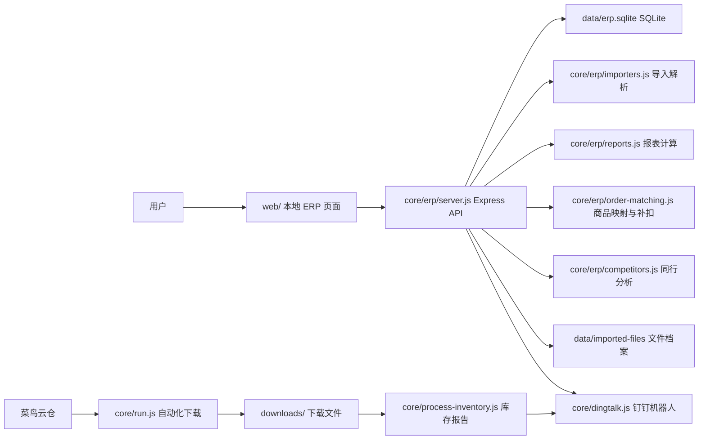

# 系统架构

本项目是一个单机本地 ERP，核心目标是把“表格导入 + 本地库存核算 + 钉钉通知 + 浏览器自动化”放在同一个可维护系统里。第一版不依赖电商平台 API，优先通过 Excel/CSV/ZIP 明细导入和公开页面抓取完成经营数据整理。

## 总体结构

## 目录职责

| 目录 | 说明 |
| --- | --- |
| `core/` | 系统底层和业务核心，包含后端服务、数据库、导入、报表、钉钉、自动化脚本。 |
| `web/` | 前端页面。当前是原生 HTML/CSS/JS，适合快速迭代本地工具。 |
| `data/` | 运行数据。`erp.sqlite` 是主数据库，`imported-files/` 存导入原文件，`product-images/` 存商品图片。 |
| `uploads/` | Express/multer 接收上传文件的临时目录。 |
| `downloads/` | 菜鸟或其他平台自动化下载的原始文件。 |
| `reports/` | 库存报表、调试截图、导出结果。 |
| `state/` | 浏览器登录态、Chrome profile、自动化运行状态。 |
| `logs/` | launchd、自动化脚本和服务日志。 |
| `docs/` | 面向维护者的架构、模块、流程文档。 |
| `automation/` | 每日流程说明、本机辅助脚本、未来自动化任务模板。 |
| `config/` | launchd 等配置模板说明。根目录 `config.json` 保留为运行时业务配置。 |

## 数据流

1. 库存数据：用户导入菜鸟库存表，系统创建或更新正式 SKU、库存快照和库存流水。
2. 月度出库数据：用户导入菜鸟“库存明细/月度销量”表，系统按 SKU、仓库、月份保存 `toC销售出`、`toB销售出`、`出库汇总` 和 `近30天销量`，用于库存总览的月出库量和补货判断。
3. 订单数据：用户导入千牛/京东/拼多多/菜鸟订单，系统按正式 SKU 或店铺商品映射扣减库存。
4. 未匹配订单商品：订单里没有正式 SKU 或映射时，进入“待维护订单商品”，不污染正式库存列表。
5. 邮费数据：用户导入菜鸟或平台账单 ZIP/Excel，系统归一为月份、平台、订单号和运费金额。
6. 经营看板：从订单、邮费、采购售后、成本价汇总销售额和预估毛利。
7. 同行分析：正式 SKU 绑定我的商品和同行链接，手动或定时抓公开价格/销量文本并保存快照；拼多多优先走移动端公开页，遇到登录要求时可用独立手机模式 profile 辅助采集。
8. 条码打印：提供 ERP 内置在线标签编辑器，按正式 SKU 保存标签模板，支持文本、时间、条形码、二维码、图片、形状、线条和 40×60mm 标签打印。
9. 钉钉通知：库存预警和月报由机器人发送，库存预警会合并低库存线和“按菜鸟月出库量估算的可售天数”，敏感 webhook 保存在 `.env.local`。

## 核心数据库表

| 表 | 作用 |
| --- | --- |
| `skus` | 正式库存商品，来源为人工或库存导入。 |
| `warehouses` | 三个仓库基础信息。 |
| `inventory_snapshots` | 每次库存导入的仓库库存快照。 |
| `inventory_movements` | 库存变动流水，包括导入、手工编辑、订单扣减、补扣。 |
| `monthly_outbound` | 菜鸟月度出库/销量数据，按 SKU、仓库、月份保存，用于可售天数和补货预警。 |
| `orders` / `order_items` | 订单和订单明细。 |
| `order_unmatched_items` | 待维护订单商品。 |
| `product_code_mappings` | 平台商品编码/规格到正式 SKU 的映射。 |
| `shipping_fees` | 邮费明细。 |
| `import_records` / `imported_files` | 导入结果和文件档案，按 hash 去重。 |
| `product_images` | SKU 商品图片。 |
| `competitors` / `competitor_snapshots` | 同行链接和每日快照。 |
| `operation_logs` | 手工编辑、补扣等操作日志。 |

## 库存补货预警口径

库存总览优先使用 `monthly_outbound.total_outbound` 计算月出库量；如果月出库量为空，则回退到 `near_30_days_sales`。系统把月出库量除以 30 得到日均出库，再用当前仓库库存或总库存估算可售天数。

| 条件 | 页面提示 | 钉钉提示 |
| --- | --- | --- |
| 可售天数小于 7 天 | 严重缺货无法发货 | 不够卖一星期，严重缺货无法发货 |
| 可售天数小于 15 天 | 急需补货 | 不够卖半个月，急需补货 |
| 可售天数小于 30 天 | 需要补货 | 不够卖一个月，需要补货 |
| 月出库量为 0 或库存足够 30 天 | 正常 | 不进入补货预警明细 |

相关代码入口：

| 功能 | 文件 |
| --- | --- |
| 月度出库导入 | `core/erp/importers.js` 的 `importMonthlyOutboundFile` |
| 导入 API | `core/erp/server.js` 的 `POST /api/import/monthly-outbound` |
| 可售天数和预警计算 | `core/erp/db.js` 的 `getInventoryReport` |
| 页面列和排序 | `web/app.js`、`web/index.html`、`web/styles.css` |
| 钉钉库存预警文案 | `core/erp/reports.js` 的 `buildInventoryMarkdown` |

## 自动化边界

- 日常“查看云仓库存”优先使用用户已经打开并登录的本机 Chrome 标签页，通过 Chrome/浏览器技能操作当前会话，不启动独立 Playwright 浏览器去过滑块。
- 不绕过验证码、滑块、短信和平台风控；如果页面要求人工验证，由用户在本机 Chrome 里完成。
- 不希望影响鼠标时，优先使用 Chrome/浏览器连接器；`core/run-local-chrome-ui.js` 是备用方案，会操作本机 Chrome UI。
- 自动化流程以 `automation/` 文档为准，新增流程时补充“入口命令、依赖登录态、输入输出、失败处理”。

## 拼多多同行采集

拼多多移动页经常只在登录态下返回商品主体数据。系统现在有两种采集方式：

1. 后端直接抓取：`core/erp/competitors.js` 使用手机浏览器请求头访问公开页，能拿到价格/销量时直接保存快照；拿不到时记录“需要登录/验证码/未识别字段”。
2. 手机模式登录采集：`core/pdd-mobile-snapshot.js` 使用独立 Playwright profile，入口为 `npm run pdd:login` 和 `npm run pdd:snapshot`。登录态保存在 `state/pdd-mobile-profile`，不影响用户主 Chrome。

这个流程不绕过验证码或风控；如果拼多多要求登录，用户在弹出的手机模式窗口里完成登录，系统只复用已授权会话读取页面可见数据。
