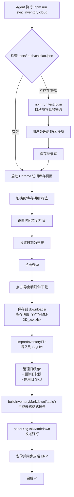

# 菜鸟库存每日自动化流程

> 本文档记录每日抓取菜鸟云仓库存并发送钉钉的完整流程，供 Agent 查阅和调用。
> 最后更新：2026-06-21

## 推荐的每日执行命令（Agent 直接调用）

```bash
npm run sync:inventory:cloud
```

这条命令会自动完成：登录 → 导出当天库存 → 导入系统 → 清理旧缓存 → 发送表格格式钉钉消息 → 安全同步云端 ERP。
采集或导入失败会立即终止，不会发送旧库存报告，也不会覆盖云端数据。

### 备用命令

| 命令 | 用途 | 说明 |
|------|------|------|
| `npm run sync:inventory:full` | 只采集、导入本地并发送钉钉 | 不同步云端 ERP |
| `npm run sync:inventory:cloud` | 采集并同步云端 ERP | 本机定时任务使用此命令 |
| `npm run sync:inventory` | 同步本地已下载的当天库存文件 | 如果本地没有当天文件会报错拒绝 |
| `npm run sync:inventory:force` | 强制重新同步同一个文件 | 忽略 fingerprint 去重 |
| `npm run watch:inventory` | 监听下载目录自动同步 | 适合配合手动 Chrome 导出 |
| `npm run test:login` | 更新登录态 | Cookie 失效时先执行这个 |

---

## 前置条件（执行前必须确认）

1. **环境变量** `.env.local` 已配置：
   - `CAINIAO_USERNAME` / `CAINIAO_PASSWORD` — 菜鸟账号密码
   - `DINGTALK_WEBHOOK` / `DINGTALK_SECRET` — 钉钉机器人地址和加签密钥
   - `LOW_STOCK_THRESHOLD=10` — 低库存预警阈值

2. **登录态文件** `tests/.auth/cainiao.json` 存在且有效。如果失效，先运行：
   ```bash
   npm run test:login
   ```
   该脚本会自动读取 `.env.local` 中的账号密码并自动填写，用户只需处理可能出现的验证码/滑块。

3. `config.json` 的 `inventoryColumns` 已正确映射列名。

---

## 全自动化流程详解（`npm run sync:inventory:full`）

### 涉及的文件

```text
core/sync-cainiao-inventory.js          # 主流程入口
core/playwright-login.js                # 登录脚本（自动填账号密码）
core/erp/importers.js                   # 库存文件导入数据库
core/erp/reports.js                     # 生成库存报告（含表格格式）
core/dingtalk.js                        # 钉钉消息发送
core/sync-cainiao-inventory-file.js     # 本地文件同步入口（含日期检查）
```

### 执行步骤



### 关键逻辑说明

1. **查询当天日期**
   - `sync-cainiao-inventory.js` 按中国时区（`Asia/Shanghai`）查询**当天**，不再使用"昨天"或"前天"。
   - 导入的 `snapshotDate` 也是当天。

2. **自动清理旧缓存**
   - 每次导入新文件后，自动执行：
     ```sql
     DELETE FROM inventory_snapshots WHERE warehouse_id = 'cainiao' AND snapshot_date != '当天日期';
     UPDATE skus SET status = 'inactive' WHERE source = 'inventory' AND status = 'active' AND sku NOT IN (SELECT sku FROM inventory_snapshots WHERE warehouse_id = 'cainiao' AND snapshot_date = '当天日期');
     ```
   - 这确保了报告中只包含当天文件里的 SKU，不会出现旧缓存残留。

3. **钉钉表格格式**
   - 使用 `buildInventoryMarkdown('table')` 生成 Markdown 表格：
     ```markdown
     | SKU | 库存/销量 | 天数 | 预警 |
     |---|---|---|---|
     | QZDLSB<br>螺丝包 | 0 / 8 | — | 🔴 不够卖 1 周 |
     ```
   - 不再是纯文本列表格式。

4. **文件同步脚本的日期检查**
   - `sync-cainiao-inventory-file.js`（`npm run sync:inventory`）会检查最新库存文件的文件名日期：
     - 如果文件名日期 ≠ 当天，直接报错拒绝同步
     - 提示用户运行 `npm run sync:inventory:full`

---

## 登录流程详解（`npm run test:login`）

当 Cookie 失效时执行：

1. 读取 `.env.local` 中的 `CAINIAO_USERNAME` 和 `CAINIAO_PASSWORD`
2. 启动 Chrome 访问菜鸟页面
3. 自动在登录框填写账号密码并点击登录
4. 等待用户处理可能出现的验证码/滑块（最多 10 分钟）
5. 登录成功后自动保存 `tests/.auth/cainiao.json`

**注意**：如果连续多次登录失败触发风控，可能需要用户手动在浏览器完成一次完整登录后再重试。

---

## 输入输出

| 类型 | 位置 | 说明 |
|------|------|------|
| 登录态 | `tests/.auth/cainiao.json` | Playwright storage state |
| 下载文件 | `downloads/库存明细_YYYY-MM-DD_xxx.xlsx` | 菜鸟导出的原始库存文件 |
| 数据库 | `data/erp.db` | SQLite，含 skus / inventory_snapshots / inventory_movements 等表 |
| 本地报告 | `reports/inventory-report-YYYY-MM-DD.md` | Markdown 格式库存报告 |
| 通知 | 钉钉群 | 表格格式库存预警消息 |

---

## 失败处理

| 问题 | 处理方式 |
|------|---------|
| Cookie 失效 | 先运行 `npm run test:login` 重新登录 |
| 卡在滑块/短信验证 | `test:login` 会自动填好账号密码，用户在弹出的 Chrome 窗口完成验证即可 |
| `sync:inventory` 报错"文件日期不是今天" | 说明本地没有当天文件，运行 `npm run sync:inventory:full` 重新导出 |
| 导出成功但 SKU 数量不对 | 检查是否有旧缓存，已在主流程中自动清理 |
| 钉钉没收到 | 检查 `.env.local` 的 `DINGTALK_WEBHOOK` 和 `DINGTALK_SECRET` |
| 列名不识别 | 在 `config.json.inventoryColumns` 增加列名别名 |

---

## Agent 调用约定

当用户要求"抓取云仓库存发送到钉钉"时，Agent 应按以下顺序执行：

1. **直接执行**：`npm run sync:inventory:cloud`
2. **如果报错 Cookie 失效**：先执行 `npm run test:login`，等待用户验证完成，再执行 `npm run sync:inventory:cloud`
3. **如果报错"文件日期不是今天"**：说明 `sync:inventory` 被错误调用，应改用 `npm run sync:inventory:cloud`
4. **成功后确认**：报告中 SKU 总数应与导入行数一致；库存总量应与当天数据匹配

## 本机定时任务

macOS 的 `com.cainiao.inventory` LaunchAgent 已配置为按中国时间每天 `22:00` 执行 `npm run sync:inventory:cloud`。在美国东部时区，它会在本机 `09:00` 和 `10:00` 各检查一次，以适配夏令时；只有中国时间为 `22:00` 的那次会真正执行。

任务日志：

```bash
tail -f logs/launchd.out.log logs/launchd.err.log
```

**不要**：
- 用 `npm run sync:inventory` 代替 `npm run sync:inventory:full` 来获取新数据
- 忽略旧缓存问题，导致报告包含已下架 SKU
- 使用纯文本列表格式发送钉钉（已废弃）
