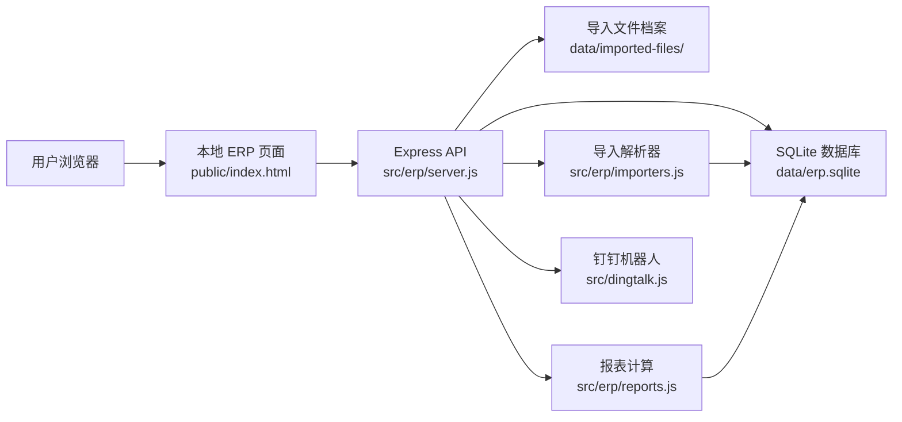
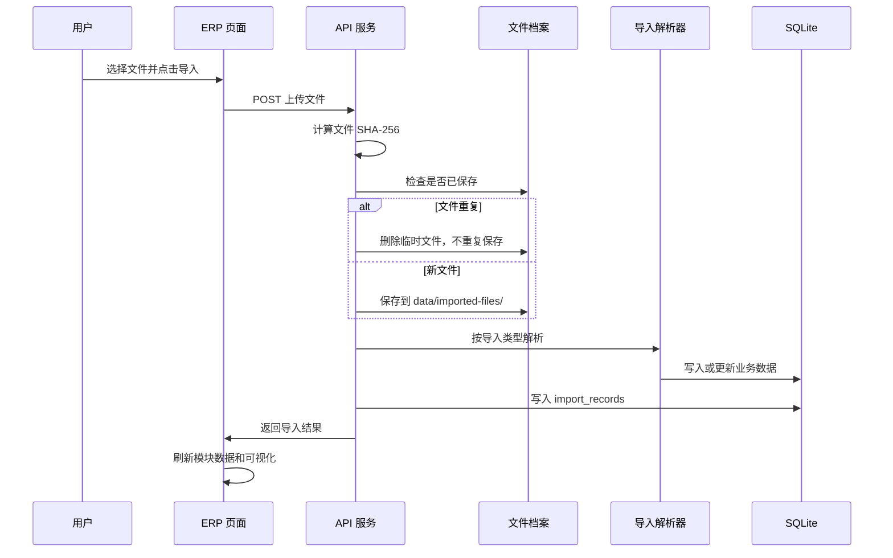

# 轻量 ERP 系统架构与设计交互文档

## 1. 项目目标

本系统是在原有“菜鸟云仓库存自动化 + 钉钉提醒”项目基础上扩展出来的本地轻量 ERP，用来管理店铺库存、订单、邮费、采购售后、固定资产、同行商品监控和钉钉通知。

第一版目标不是替代完整商业 ERP，而是先解决日常经营里最费时间、最容易漏看的几件事：

- 多来源数据统一导入：菜鸟云仓、千牛、京东、拼多多、邮费账单、项目文件夹资料。
- 库存统一查看：三个仓库库存、SKU 成本、低库存预警集中在一个列表。
- 经营数据可视化：导入后自动在看板展示，不需要额外点击“生成月报”。
- 文件可追溯：导入过的原始文件自动保存，重复文件不重复保存。
- 钉钉提醒：库存预警、月度报表、异常摘要可以发送到钉钉群。
- 后续扩展：预留平台 API、钉钉表格同步、同行商品监控、自动报表等能力。

## 2. 当前技术架构

系统采用本地 Node.js 服务 + SQLite 数据库 + 静态网页后台的方式运行，适合单机使用，不需要额外部署数据库。



### 2.1 核心目录

| 路径 | 作用 |
| --- | --- |
| `src/erp/server.js` | 本地 ERP 服务入口，提供页面、API、上传、下载、钉钉发送 |
| `src/erp/db.js` | SQLite 数据库初始化和表结构 |
| `src/erp/importers.js` | 库存、订单、邮费文件解析与导入 |
| `src/erp/reports.js` | 仪表盘、库存报表、月度销售、经营看板数据计算 |
| `src/erp/file-archive.js` | 导入文件保存、SHA-256 去重、下载档案 |
| `src/erp/import-project-folder.js` | 扫描项目文件夹并导入可用经营资料 |
| `src/dingtalk.js` | 钉钉机器人发送能力 |
| `public/index.html` | ERP 页面结构 |
| `public/app.js` | 前端交互、API 调用、表格渲染 |
| `public/styles.css` | 页面视觉样式 |
| `data/erp.sqlite` | 本地业务数据库 |
| `data/imported-files/` | 原始导入文件档案 |

## 3. 运行方式

启动本地 ERP：

```bash
npm run erp
```

默认访问地址：

```text
http://localhost:3000/
```

数据保存在本机，不会自动上传到第三方服务器。钉钉机器人发送需要 `.env.local` 中配置 webhook 和加签密钥。

## 4. 数据模型设计

### 4.1 主数据表

| 表 | 说明 |
| --- | --- |
| `warehouses` | 仓库信息，默认包含菜鸟云仓、上海仓库、诸暨仓库 |
| `skus` | SKU 主数据，包含商品名、成本价、预警线、平台编码 |
| `inventory_snapshots` | 库存快照，按 SKU、仓库、盘点日期记录库存数量 |

### 4.2 经营数据表

| 表 | 说明 |
| --- | --- |
| `orders` | 订单主表，统一不同平台订单 |
| `order_items` | 订单明细，按 SKU 记录销量、金额、退款状态 |
| `shipping_fees` | 邮费明细，按平台、月份、订单号、金额归一化 |
| `monthly_financials` | 项目文件中可识别的月度财务汇总 |
| `purchase_records` | 采购记录 |
| `return_records` | 售后和退货记录 |
| `fixed_assets` | 固定资产记录 |

### 4.3 导入和监控表

| 表 | 说明 |
| --- | --- |
| `import_records` | 每次导入的结果记录，包含类型、来源、成功数量、失败信息 |
| `imported_files` | 原始导入文件档案，按文件内容 hash 去重 |
| `competitors` | 同行商品链接配置 |
| `competitor_snapshots` | 同行商品每日快照，记录价格、销量、失败原因 |

## 5. 模块设计

### 5.1 库存总览

库存总览是日常使用频率最高的模块，负责展示 SKU、库存、成本和预警状态。

主要能力：

- 查看商品 SKU、商品名称、实际库存、订单占有数、销量、退货量。
- 直接在列表里编辑 SKU 成本价。
- 直接在列表里编辑低库存预警线，默认低于 10 提醒。
- 低库存商品自动标记，方便发送钉钉库存预警。
- 后续可扩展按仓库筛选、按平台 SKU 映射、按销量预测可售天数。

交互原则：

- 成本价和预警线不单独放一个页面，直接在库存列表编辑。
- 编辑后点击当前行保存，不影响其他 SKU。
- 库存为空时显示空状态，提醒先去导入中心导入库存文件。

### 5.2 导入中心与文件档案

导入中心负责所有文件导入，并合并“文件档案”能力。

支持导入：

- 菜鸟库存文件。
- 菜鸟、千牛、京东、拼多多订单文件。
- 菜鸟邮费账单、平台邮费账单。
- 项目文件夹中可识别的经营资料。

文件保存规则：

- 上传文件后先计算 SHA-256 内容 hash。
- 如果同一个文件内容已经导入过，不再重复保存原始文件。
- 如果文件内容不同，即使文件名相同，也会保存为新的档案。
- 保存后的文件可以在导入中心直接下载，方便以后查账或重新核对。

交互原则：

- 导入成功后立刻刷新看板和报表数据。
- 导入记录显示类型、来源、成功数量、时间和错误信息。
- 文件档案显示原始文件名、导入类型、文件大小、导入时间和下载按钮。
- 重要扫描操作，例如“重新扫描项目文件”，需要二次确认，避免误导入旧数据。

### 5.3 经营看板

经营看板用于把导入后的数据自动可视化。

当前展示：

- 月度销售额。
- 月度邮费。
- 采购与售后数据。
- 固定资产摘要。
- SKU 月度销售表。

交互原则：

- 导入后自动展示，不需要点击“生成月报”。
- 月份筛选只改变展示范围，不生成额外数据。
- 没有数据时显示空状态，不混入历史测试数据。

### 5.4 采购售后

采购售后用于查看项目文件夹或后续平台导入得到的采购、退货、售后信息。

主要能力：

- 按月份查看采购笔数和采购金额。
- 查看售后、退货数量。
- 后续可扩展采购成本分摊、供应商统计、采购价波动。

### 5.5 固定资产

固定资产模块用于管理项目资料中的设备、工具、办公资产等。

主要能力：

- 展示资产名称、类别、金额、日期、来源文件。
- 后续可扩展折旧、使用部门、报废状态。

### 5.6 同行分析

同行分析用于维护自己商品和同行商品链接，并尝试抓取公开页面上的价格和销量。

边界规则：

- 不绕过验证码。
- 不绕过登录墙。
- 不强行推断平台未公开展示的销量。
- 如果抓取失败，记录失败原因，不影响 ERP 其他模块。

后续可扩展：

- 每日定时快照。
- 价格变化提醒。
- 同行销量趋势。
- 自己商品与同行商品价格对比表。

### 5.7 钉钉同步

钉钉同步用于把关键经营信息推送到群里。

当前优先级：

- 库存低于预警线时发送库存预警。
- 手动发送月度经营摘要。
- 无低库存时发送“库存正常”摘要。

后续扩展：

- 钉钉表格同步。
- 每日自动发送库存预警。
- 每月自动发送销售、邮费、毛利报表。

## 6. 数据导入流程

### 6.1 通用导入流程



### 6.2 菜鸟库存导入

规则：

- 菜鸟库存表作为 SKU 和库存基础来源。
- 如果 SKU 不存在，自动创建 SKU。
- 如果 SKU 已存在，只更新名称、库存快照等必要字段，不覆盖用户手动维护的成本价。
- 按 SKU、仓库、盘点日期记录库存快照。

### 6.3 订单导入

规则：

- 不同平台订单统一成平台、订单号、SKU、数量、实付金额、退款状态、下单时间。
- 重复导入时按平台、订单号、SKU 去重或更新。
- 月度销售额和 SKU 销量由订单明细实时汇总。

### 6.4 邮费导入

规则：

- 支持普通 Excel/CSV，也支持菜鸟下载的 zip 明细包。
- zip 内如果有多个文件，会优先选择包含交易账单和计费金额字段的汇总文件。
- 邮费按平台、月份、订单号、运费金额归一化。
- 重复导入同一订单邮费时更新，不重复累加。

### 6.5 项目文件夹扫描

项目文件夹扫描用于读取已有项目资料，例如财务表、采购表、售后表、固定资产表。

规则：

- 只在用户明确点击并确认后执行。
- 跳过明显包含身份证、手机号、地址等敏感个人信息的文件。
- 导入后写入对应经营表和导入记录。
- 该功能适合补录历史经营数据，不建议在测试清空后随手点击。

## 7. API 设计

### 7.1 导入相关

| 方法 | 路径 | 说明 |
| --- | --- | --- |
| `POST` | `/api/import/inventory` | 导入库存文件 |
| `POST` | `/api/import/orders` | 导入订单文件 |
| `POST` | `/api/import/shipping-fees` | 导入邮费文件 |
| `GET` | `/api/import/records` | 查看导入记录 |
| `GET` | `/api/import/files` | 查看已保存的导入文件 |
| `GET` | `/api/import/files/:hash/download` | 下载原始导入文件 |
| `POST` | `/api/import/project-folder` | 扫描项目文件夹并导入数据 |

### 7.2 报表相关

| 方法 | 路径 | 说明 |
| --- | --- | --- |
| `GET` | `/api/dashboard` | 首页仪表盘摘要 |
| `GET` | `/api/reports/inventory` | 库存总览 |
| `GET` | `/api/reports/monthly-sales?month=YYYY-MM` | 月度 SKU 销售报表 |
| `GET` | `/api/business/overview` | 经营看板汇总数据 |
| `POST` | `/api/dingtalk/send-report` | 发送钉钉报表 |

### 7.3 SKU 和同行相关

| 方法 | 路径 | 说明 |
| --- | --- | --- |
| `PUT` | `/api/skus/:sku` | 更新 SKU 成本价、预警线等 |
| `POST` | `/api/competitors` | 新增同行商品链接 |
| `GET` | `/api/competitors` | 查看同行商品 |
| `POST` | `/api/competitors/run-snapshot` | 手动执行同行快照 |

## 8. 页面交互设计

### 8.1 页面布局

页面采用顶部模块导航，不使用传统左侧大按钮栏，减少遮挡和老式后台感。

模块顺序：

1. 库存总览
2. 导入中心
3. 经营看板
4. 采购售后
5. 固定资产
6. 同行分析

设计原则：

- 页面同一时间只展示一个模块，避免信息堆在一起。
- 重要数字用卡片和轻量图表展示。
- 表格用于承载可操作数据，例如 SKU 成本、库存、文件档案。
- 操作按钮集中在对应模块内，不在顶部堆满按钮。

### 8.2 库存总览交互

用户进入系统后优先看到库存总览。

主要交互：

- 搜索或筛选 SKU。
- 查看库存、销量、退货、可售天数。
- 在成本价输入框中修改成本。
- 在预警线输入框中修改预警数量。
- 点击保存后更新当前 SKU。

### 8.3 导入中心交互

导入中心分为三块：

- 数据导入：库存、订单、邮费。
- 导入记录：最近导入是否成功。
- 文件档案：原始文件下载。

上传完成后：

- 如果是新文件，保存文件档案并导入数据。
- 如果是重复文件，提示文件已存在，不重复保存。
- 如果导入失败，显示失败原因。

### 8.4 经营看板交互

经营看板不要求用户点击生成报表。

行为：

- 打开模块时自动读取现有数据。
- 导入新数据后自动刷新。
- 月份选择只用于查看某个月的数据。
- 钉钉月报按钮用于把当前报表摘要发送到钉钉群。

### 8.5 异常和空状态

系统需要明确告诉用户当前状态：

- 没有库存数据：提示先导入库存。
- 没有订单数据：销售额显示为空或 0，不展示历史测试数据。
- 邮费文件重复：提示已存在，不重复保存。
- 同行抓取失败：显示失败原因，而不是让页面报错。

## 9. 去重和数据安全

### 9.1 文件去重

文件去重使用文件内容 hash，不只看文件名。

这样可以避免：

- 同一个文件改名后重复保存。
- 同一个 zip 从不同目录上传后重复保存。
- 测试时反复导入同一文件导致档案混乱。

### 9.2 数据去重

不同数据类型采用不同业务键：

| 类型 | 去重逻辑 |
| --- | --- |
| 库存 | SKU + 仓库 + 盘点日期 |
| 订单 | 平台 + 订单号 + SKU |
| 邮费 | 平台 + 月份 + 订单号 |
| 文件档案 | 文件内容 SHA-256 |

### 9.3 隐私边界

系统设计时遵守以下原则：

- 不绕过验证码和滑块。
- 不强行抓取登录墙后的数据。
- 不使用鼠标控制用户电脑执行日常自动化。
- 项目文件夹扫描会避开包含大量个人隐私字段的文件。
- 密码、钉钉 webhook、加签密钥应保存在 `.env.local`，不写入代码和文档。

## 10. 自动化设计

当前自动化优先选择两条路线：

1. 本地网页后台手动导入 Excel/CSV/zip，稳定、不受验证码影响。
2. 定时任务发送库存预警和经营摘要。

不优先做的事情：

- 不依赖滑块验证页面做核心数据来源。
- 不用鼠标接管电脑影响用户工作。
- 不对平台页面做违反规则的自动化抓取。

未来如果平台提供 API 或稳定导出入口，可以逐步把手动导入替换成自动同步。

## 11. 当前已实现能力

- 本地 ERP 页面。
- 模块化页面导航。
- 库存总览。
- SKU 成本和预警线在库存列表直接编辑。
- 导入中心。
- 文件档案与导入中心合并。
- 导入文件按内容 hash 去重保存。
- 菜鸟邮费 zip 明细解析。
- 经营看板自动展示已有数据。
- 采购售后、固定资产基础模块。
- 同行分析基础模块。
- 钉钉机器人报表发送入口。

## 12. 后续建议开发

优先级从高到低：

1. 库存总览增加仓库筛选和三仓合并库存视图。
2. 导入中心增加拖拽上传和批量导入。
3. 经营看板增加邮费趋势图、销售额与邮费占比图。
4. SKU 管理增加平台编码映射，例如菜鸟 SKU、千牛商家编码、京东编码、拼多多编码。
5. 钉钉表格同步，把库存和月报同步到指定表格。
6. 自动备份 `data/erp.sqlite` 和 `data/imported-files/`。
7. 增加“测试数据清空”功能，允许选择清空全部或只清空某一类数据。
8. 同行分析增加价格变化提醒和截图证据。
9. 增加权限和操作日志，记录谁改了成本价和预警线。
10. 增加采购成本批次管理，支持更准确的毛利计算。

## 13. 使用注意事项

- 测试前如果要清空数据，应同时确认是否保留导入文件档案。
- 清空历史经营数据后，不要随手点击“重新扫描项目文件”，否则会把项目文件夹中的历史资料重新导入。
- 导入邮费后，经营看板会自动显示邮费数据，不需要生成月报。
- 只有导入订单后，SKU 销量、销售额、毛利估算才会完整。
- 只有导入库存后，库存总览和低库存预警才会完整。

